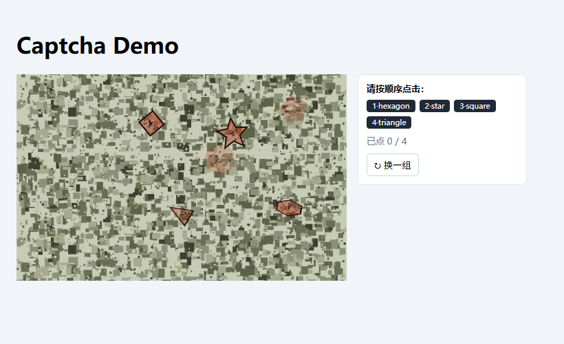
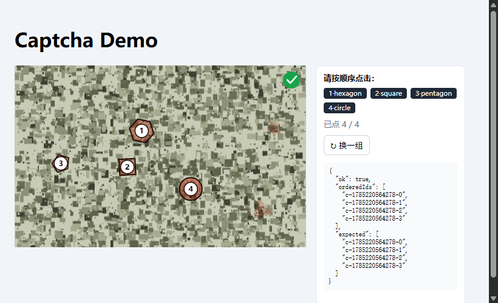

# Captcha Canvas

A Vue 3 captcha component using pure Canvas 2D. Backend defines shape challenge sets; component renders them as **animated geometric figures** on a scrolling digital-camouflage background. Users must **click shapes in the correct sequence** to pass verification.

<p align="center">
  
  
</p>

## Features

- **Digital-camo background** — multi-grain pixel-block noise with smooth vertical scroll (createPattern tile loop, no flicker)
- **Irregular shape motion** — cubic Bézier paths with random control points, regenerated smoothly (head-to-tail continuity)
- **2D rotation + 3D tilt** — each shape randomly assigned spin, tilt oscillation, or both
- **Transparent-gradient fills** — per-shape random radial/linear gradients with irregular dot stipple
- **Decoy shapes** — auto-generated, visually blended into the noise (no outline)
- **Ordered click verification** — click shapes in backend-specified sequence; emits `{ ok, orderedIds, expected }`
- **Responsive** — ResizeObserver rebuilds engine at container dimensions; DPR clamped at 2
- **Framework-free engine** — `CaptchaEngine` + `Renderer` are pure TS, unit-testable without Vue

## Quick Start

```bash
npm install
npm run dev
```

Open http://localhost:5173 — the demo page generates random challenge sets with a side panel showing order hints and click progress.

## Usage

```vue
<script setup lang="ts">
import CaptchaCanvas from './components/CaptchaCanvas.vue'
import type { Challenge, VerifyResult } from './captcha/types'

const challenges: Challenge[] = [
  { id: 'a', shape: 'circle', order: 1 },
  { id: 'b', shape: 'triangle', order: 2 },
  { id: 'c', shape: 'square', order: 3 },
  { id: 'd', shape: 'star', order: 4 }
]

function onVerify(result: VerifyResult) {
  if (result.ok) {
    // submit to backend
  }
}
</script>

<template>
  <CaptchaCanvas
    :challenges="challenges"
    :width="480"
    :height="300"
    :decoy-range="[1, 2]"
    :motion-speed="1"
    @verify="onVerify"
    @progress="(picked, total) => console.log(picked, total)"
  />
</template>
```

### Props

| Name | Type | Default | Description |
|---|---|---|---|
| `challenges` | `Challenge[]` | (required) | Backend-provided shape definitions with `id`, `shape`, `order` |
| `width` | `number` | `320` | Logical canvas width (px) |
| `height` | `number` | `200` | Logical canvas height (px) |
| `decoyRange` | `[number, number]` | `[1, 2]` | How many extra decoy shapes to generate (inclusive) |
| `motionSpeed` | `number` | `1` | Multiplier for Bézier advancement |
| `disabled` | `boolean` | `false` | Pauses rendering and click handling |

### Shape Types

`'circle' | 'triangle' | 'square' | 'star' | 'pentagon' | 'hexagon'`

### Emits

| Event | Payload | When |
|---|---|---|
| `verify` | `VerifyResult { ok, orderedIds, expected }` | After `challenges.length` clicks |
| `progress` | `(picked: number, total: number)` | On every captured click |
| `refresh` | (none) | User clicks refresh button |

### Imperative API (defineExpose)

```ts
refresh()              // regenerate challenges + decoys, re-randomize motion
reset()                // release captured shapes back to moving
getState()             // returns { shapes, verified, pickOrder, scrollOffset }
simulateClick(x, y)    // programmatic click (for testing)
```

## Architecture

```
CaptchaCanvas.vue  ──  Vue SFC (props/emits/slots + ResizeObserver + DPR)
  └─ CaptchaEngine ──  rAF main loop, state machine, hit-test, verify emission
       └─ Renderer  ──  camo tile + shape drawing (gradient + stipple) + overlays
            ├─ shapes.ts   ──  Canvas Path2D generators
            ├─ motion.ts   ──  Bézier control points + advance
            ├─ palette.ts  ──  camo colors + weighted picker
            └─ types.ts    ──  Challenge / VerifyResult / ShapeRenderMeta
```

## Behavior

- Shape states: `spawned → moving → captured (frozen)` — disarmed on `reset()`/`refresh()`
- `verify` fires exactly once after N clicks; decoy clicks count but produce `ok: false`
- ResizeObserver re-builds engine at new dimensions (control points re-randomized)
- DPR clamped at 2; camo rendered via `createPattern` for seamless scroll loop
- Duplicate `id`/`order` trigger `console.warn` (engine still works)

## Commands

| Command | Description |
|---|---|
| `npm run dev` | Vite dev server (port 5173) |
| `npm run build` | Type-check + production build to `dist/` |
| `npm test` | All 32 unit/component tests (vitest) |
| `npm run test:e2e` | Playwright full-verify flow test |
| `npm run typecheck` | vue-tsc only |

## Tests

- 32 unit + component tests across 7 files
- `CaptchaEngine`, `Renderer`, `shapes`, `motion`, `palette` — direct unit tests
- `CaptchaCanvas.vue` — component tests via `@vue/test-utils`
- `tests/e2e/captcha.spec.ts` — Playwright browser automation
- `tests/setup.ts` — polyfills `Path2D` + mocks `getContext('2d')` for jsdom

## Stack

Vite · Vue 3 (script setup) + TypeScript · Pure Canvas 2D · Vitest · Playwright

## License

MIT